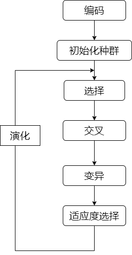
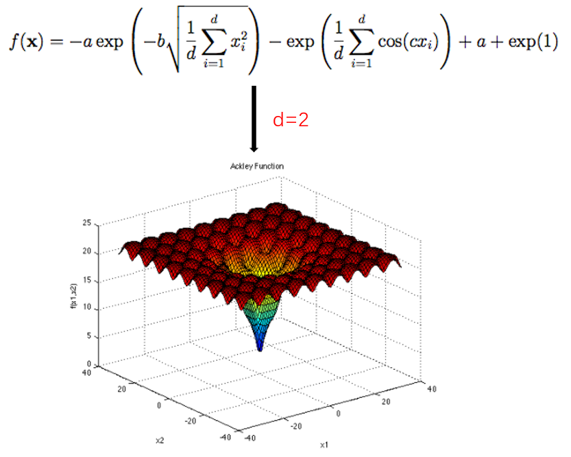
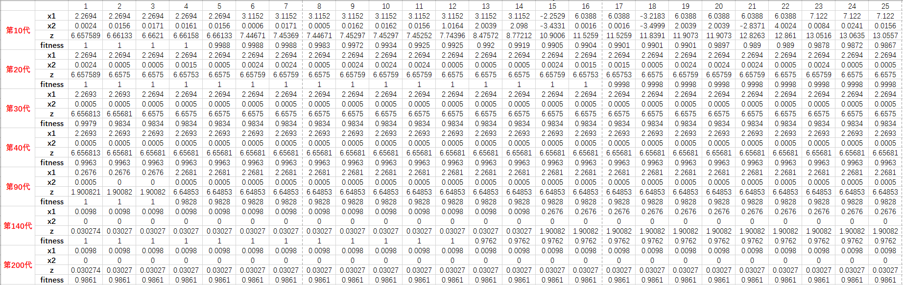
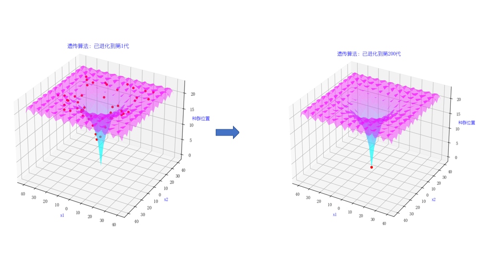

### <div align=center>遗传算法求解Ackley函数的最小值</div>


## 一、遗传算法的定义

 &emsp;&emsp; **遗传算法(Genetic Algorithm, GA)**，是模拟达尔文生物进化论的自然选择和遗传学机理的生物进化过程的计算模型， 是一种通过模拟自然进化过程搜索全局最优解的方法。其本质是一种高效、并行、全局搜索的方法，能够在搜索过程中自动获取和积累有关搜索空间的知识，并自适应的控制搜索过程。
 &emsp;&emsp;该算法以一个种群中的个体为对象，并利用随机化技术对一个被编码的个体在参数空间中进行高效的搜索。其中，基因选择、交叉、变异和参数编码、参数解码、适应度选择、初始种群设定构成了遗传算法的核心内容。其主要特点就是可以直接对参数对象进行操作，从而避免了繁琐的求导过程（尤其是一些复杂的函数求导），具有内在的内在的隐并行性和更好的全局寻优能力。采用随机概率化的寻优方法，不需要额外去确定寻优规则，可以自适应的调整寻优方向。

## 二、遗传算法相关术语
  **基因型：** 性染色体的内部表现；<br/>
  **表现型：** 染色体决定的性状的外部表现，也就是基因型的外部表现；<br/>
  **进化：** 种群逐渐适应生存环境，并淘汰掉不适应环境的种群个体；<br/>
  **选择：** 根据适应度优胜劣汰的法则，选择适应度高的种群个体；<br/>
  **复制：** 新个体的一部分基因从其父母基因继承复制而来；<br/>
  **交叉：** 新个体的一部分基因从其父母的基因通过某种交叉规则得到；<br/>
  **变异：** 在产生新个体的时，可能产生新的染色体（小概率）,表现出新的性状；<br/>
  **编码：** DNA中遗传信息按某种模式排序，遗传编码可以看作从表现型到基因型的映射；<br/>
  **解码：** 对DNA链进行解读，也就是基因型到表现型的映射；<br/>

## 三、算法流程图
<div align=center></div>

## 四、算法实现过程
  &emsp;&emsp;Ackley函数，其定义和二维参数空间下的函数图像如下：
  <div align=center></div>
  如上图所示，在二维参数空间中，Ackley函数图像的特点是它的外部区域有很多小的山峰，而中心则是一个往里凹陷进去的大洞，无论是使用梯度下降算法还是爬山算法，都有可能陷入到局部最小值而无法得到全局最小值。
  如何求解该函数的全局最优解呢？不妨跳出传统的数学思维，用遗传学的观点来思考这个问题。我们可以假定该函数就是一个种群的生存环境，那么单个函数值就可以代表一个种群的一个个体。根据生物进化理论，我们可以假定函数值越大，那么个体对环境的适应度就越小，函数值越小就表示个体对环境的适应度越大。根据环境适应度选择，可以逐步淘汰掉适应度低的种群个体，保留适应度高的种群个体，由此可以实现种群的进化，也就是求得全局最优解。

  &emsp;&emsp;**具体实现过程如下：** <br/>
  &emsp;  1. 随机产生初始化种群；<br/>
  &emsp;  2. 种群通过一定的方法进行基因交叉产生子代；<br/>
  &emsp;  3. 子代的基因在交叉的过程中可能产生变异；<br/>
  &emsp;  4. 根据策略判断个体的适应度，淘汰掉适应度低的种群个体；<br/>
  &emsp;  5. 返回到步骤2，直至最优解产生；<br/>
  
  #### 4.1 定义种群生存环境 —— Ackley函数
  根据Ackley函数的表达式，其python实现代码如下：
   ```python
    # 种群生存环境
    def function_env_Ackley(x, y):
        a = 20
        b = 0.2
        c = 2 * np.pi
        sum1 = (x ** 2 + y ** 2)
        sum2 = np.cos(c * x) + np.cos(c * y)

        term1 = - a * np.exp(-b * np.sqrt(sum1 / 2))
        term2 = -np.exp(sum2 / 2)
        z = term1 + term2 + a + np.exp(1)
        return z
   ```
  #### 4.2 初始化种群数量
  &emsp;&emsp;在生成种群之前，首先要定义种群个体的DNA的表示方法。使用二进制编码法（还有浮点编码法、符号编码法）来表示DNA链是比较合适，因为0，1可以表示DNA的两种碱基，足够长的二进制染色体能够表示所有的特征，而且二进制编码DNA使得编码解码过程变得简单，基因交叉、变异也更加易于实现。<br/>
  &emsp;&emsp;初始化种群及二进制编码的python实现如下：
  ```python
  def initial_population(pop_num: int, DNA_SIZE):
    for i in range(pop_num):
        pop_dna = np.random.randint(0, 2, size=DNA_SIZE * 2)  # 随机生成种群个体的 DNA　序列
        pop.append(pop_dna)
    # print(pop)
    return pop  # 返回种群列表
  ```
  上述代码中DNA_SIZE表示DNA链的长度，pop_num表示需要初始化的种群数量。<br/>
  &emsp;&emsp;DNA的编码过程体现了从生物的表现型到基因型的映射关系，那么其解码过程则体现了生物基因序列到生物外在性状表现的映射关系。
  ```python
  def decode_dna(dna):
    x1_t = 0
    x2_t = 0

    dna1 = dna[0:DNA_SIZE]  # x1
    dna2 = dna[DNA_SIZE:]  # x2
    # 解码过程
    for i, data in enumerate(dna1):
        if data == 1:
            x1_t += 2 ** i
    # 解码过程
    for j, data in enumerate(dna2):
        if data == 1:
            x2_t += 2 ** j

    # 把 DNA　解码值约束到（-32, 32）
    x1 = x1_t * 2 / ((2 ** DNA_SIZE) - 1) - 1
    x2 = x2_t * 2 / ((2 ** DNA_SIZE) - 1) - 1
    x1 = x1 * 32
    x2 = x2 * 32
    x1 = round(x1, 4)  # 保留小数点后4位
    x2 = round(x2, 4)

    transDNA1.append(x1)
    transDNA2.append(x2)
    return transDNA1, transDNA2  # 返回个体 DNA 解码列表1, 解码列表2
  ```
  #### 4.3　种群基因交叉
  &emsp;&emsp;种群通过基因交叉产生子代，基因交叉的规则是取父亲基因的前段基因作为子代的前段基因，父亲和母亲的后段基因的按位相与构成子代的后段基因，其python实现代码如下：
  ```python
  # 基因交叉
def cross_dna(father, mother):
    father_arr = np.array(father[0:DNA_SIZE])
    mother_arr = np.array(mother[DNA_SIZE:])
    c1 = father[0:DNA_SIZE]  # 继承父亲前端基因
    c2 = np.bitwise_and(father_arr, mother_arr)  # 后端基因是父母基因的按位相与的结果
    c1 = list(c1)
    c2 = list(c2)
    child_dna = c1 + c2

    return child_dna
  ```
  产生子代的过程中，在保证产生一个子代的同时，也有一定概率产生二胎：
  ```python
  if np.random.rand() > DOUBLE_CHILD_RATE:
	child_2_dna = cross_dna(moth, fath)
    child_list.append(child_2_dna)
    print("已产生二胎")
  ```
  DOUBLE_CHILD_RATE为产生二胎的概率。<br/>
  生成子代时，其基因可能发生变异：
  ```python
  # 基因突变
def mutation_dna(dna_2):
    if np.random.rand() < MUTATION_RATE:
        m = random.randint(1, 5)  # 基因突变的长度
        print("基因突变的编码个数：", m)
        m1 = random.sample(range(0, DNA_SIZE), m)  # 基因突变的位置（随机生成）
        for i in m1:
            if dna_2[i] == 1:
                dna_2[i] = 0
            else:
                dna_2[i] = 1
        print("子代发生突变！")
    return dna_2
  ```
  上述代码中的MUTATION_RATE表示变异个数，在突变的过程中，DNA长链中随机的１到４个碱基会发生突变。

  #### 4.4　适应度选择
  &emsp;&emsp;根据进化理论中的物竞天择，适者生存，暂时忽略种群内部之间的相互竞争，可以根据它们对环境的适应度来决定它们中谁能够存活，而这个衡量的标准就是适应度函数。种群在生存环境中所处的位置越低，就表示其适应度越高。
  ```python
  # 适应度
def get_fitness(x1, x2):
    z = function_env_Ackley(x1, x2)

    fitness = (z - np.min(z))
 + 1e-4
    fitness = fitness / fitness.sum()
    fitness = -np.round(fitness, 4) * 10 + 1  # z值越大，适应度越小
    print(f"适应度:{fitness}")
    return fitness
  ```
  上述代码把个体适应度的值约束到了[0,1]之间。根据适应度大小，选择一定规模的适应度高的种群保留，消灭其余适应度相对较低的个体。
  ```python
  sort_idx = np.argsort(-fitness)  # 按降序排列，输出原索引值
 sort_idx = list(sort_idx)  # 数组转列表
 sort_idx = sort_idx[:num]  # 取初始大小的种群存活，过滤掉适应度较小的个体
  ```
## 五、结果与总结
 #### 5.1 结果
 &emsp;&emsp;随机生成50个初始种群个体（由于版面原因，只截取了前25个种群个体数据），其繁衍200代后的数据结果及图像展示如下:
 
 <div align=center></div>

 从上面数据及图像（上面图像其实是动态显示，这里体现不出来）可以看出，基本到100~150代左右就可以收敛到全局最优解了。如果初始种群靠近最优值时，其收敛速度会更加的快，可能50代左右就收敛了；当把初始种群数量增大，其收敛速度也会更快，如下图表格所示:
 <div align=center></div>

 从上面的二维折线图可以清楚的看到种群随迭代次数收敛的情况。当初始种群数量超过100时，其收敛的速度几乎相同，都在20~50代就完成收敛了。当初始种群数量比较小时，其收敛速度与种群个体的突变概率有很强的相关性，突变概率越大，越容易收敛；突变概率越小，就越不容易收敛。<br/>
 &emsp;&emsp;在实验的过程中，种群的适应度函数的选择对收敛效果影响较大。适应度选择不当，可能导致遗传算法陷入局部最优解。

 #### 5.2 总结与收获
  &emsp;&emsp;遗传算法通过模仿自然界中的选择和遗传机制来求解函数的最优解问题，为函数寻优提供了一种摆脱传统函数求导寻优的思维方式，通过对遗传参数的调整，可以很快的求解出函数的全局最优解。遗传算法虽然能够找到最优解，即使是在比较复杂的解空间中，但是具体情况要具体分析，适应度函数选择不当时，遗传算法很有可能会陷入局部最优解，从而不能达到全局最优。<br/>
  &emsp;&emsp;遗传算法将生物进化论的观点代入到了数学函数求解问题中，在我看来是比较新怡的。该算法突破了数学规划法中的点对点的搜索方法，可以在整个解空间同时开始寻优搜索，注重区域搜索和空间扩展平衡，具备全局最有搜索性，还可以处理带有随机、不确定的离散搜索空间问题，而这正是数学规划法所难以克服的。
